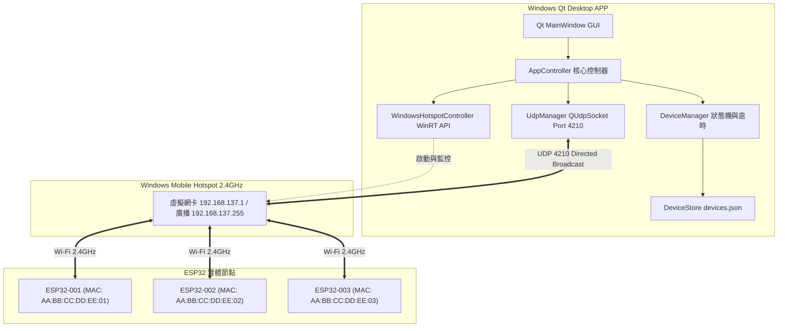

# ESP32 Windows Hotspot & Key Broadcast Manager

[](https://microsoft.com)
[](https://qt.io)
[](https://en.cppreference.com/w/cpp/17)
[-red.svg)](https://espressif.com)
[](LICENSE)

一個以 **Qt 6 / C++17** 開發的 Windows 桌面應用程式，具備自動啟用 **Windows Mobile Hotspot（行動熱點 2.4 GHz）**、多台 ESP32 UDP 裝置註冊與 MAC/ID 管理、單次 Key 定向廣播與 3 秒 ACK 回覆狀態追蹤之完整系統。

---

## 系統架構 (System Architecture)



---

## 主要特色 (Key Features)

1. **原生 Windows 行動熱點控制**：
   - 整合微軟 Windows Runtime (`NetworkOperatorTetheringManager`) API。
   - 在背景非同步執行熱點開關、設定 SSID/密碼、強制鎖定 2.4 GHz 頻段並實時監控連線裝置數，保證 GUI 介面流暢不卡頓。
   - 提供快速開啟 `ms-settings:network-mobilehotspot` 之捷徑與 Mock 模擬測試模式（`--mock`）。

2. **UDP 4210 定向廣播通訊**：
   - 固定監聽 `Port 4210` (`QUdpSocket::ShareAddress | QUdpSocket::ReuseAddressHint`)。
   - 自動掃描網卡並鎖定 Windows 行動熱點子網段（預設 `192.168.137.x`），使用 Directed Broadcast（`192.168.137.255`）發送，避免廣播封包發送至 VPN 或 Ethernet 網卡。

3. **MAC 正規化與 ID 關聯管理**：
   - 接收 ESP32 Hello 封包時，將 MAC 地址清洗規範化為標準大寫格式（`AA:BB:CC:DD:EE:FF`）。
   - **以 MAC 為主要識別鍵，確認 ID 是來自哪台裝置**，並持久化保存至 `%AppData%/ESP32Host/ESP32QtApp/devices.json`。

4. **單次 Key 廣播與 ACK 狀態機**：
   - 使用者於 GUI 輸入 `chunk_key`，按下「廣播 Key（一次）」後產生唯一 UUIDv4 `message_id`。
   - 所有線上裝置立即標記為 `WAITING_ACK` 並啟動 **3 秒** 逾時計時器。
   - ESP32 收到 Key 後，將 ACK 直接回覆至封包來源 IP 與來源 Port。
   - 狀態即時切換：`ONLINE`（在線）、`WAITING_ACK`（等待回覆）、`KEY_RECEIVED`（成功接收）、`TIMEOUT`（逾時未回覆）、`ERROR`（裝置報錯）、`OFFLINE`（心跳逾時離線）。

---

## 通訊協定規格 (UDP Protocol Specification)

所有 UDP Datagram 均為 UTF-8 JSON 格式，無額外換行符號。

### 1. ESP32 註冊封包 (`hello`)
ESP32 連上 Wi-Fi 後或每 5 秒定時發送：
```json
{
  "protocol": "esp32-control",
  "version": 1,
  "type": "hello",
  "mac": "AA:BB:CC:DD:EE:01",
  "id": "ESP32-001",
  "firmware": "1.0.0"
}
```

### 2. 電腦廣播 Key 封包 (`set_key`)
使用者點擊廣播按鈕時發送一次（定向廣播）：
```json
{
  "protocol": "esp32-control",
  "version": 1,
  "type": "set_key",
  "message_id": "c1f8e4da-6c7b-4d43-9f20-4a30efb72611",
  "target": "all",
  "chunk_key": "USER_DEFINED_KEY",
  "timestamp": "2026-09-06T02:00:00Z"
}
```

### 3. ESP32 回覆確認封包 (`key_ack`)
ESP32 處理完成後，回傳至 UDP 封包的來源 IP (`udp.remoteIP()`) 與 Port (`udp.remotePort()`)：
```json
{
  "protocol": "esp32-control",
  "version": 1,
  "type": "key_ack",
  "message_id": "c1f8e4da-6c7b-4d43-9f20-4a30efb72611",
  "mac": "AA:BB:CC:DD:EE:01",
  "id": "ESP32-001",
  "status": "ok",
  "message": "key received"
}
```
*發生錯誤時：*
```json
{
  "protocol": "esp32-control",
  "version": 1,
  "type": "key_ack",
  "message_id": "c1f8e4da-6c7b-4d43-9f20-4a30efb72611",
  "mac": "AA:BB:CC:DD:EE:01",
  "id": "ESP32-001",
  "status": "error",
  "error_code": "FLASH_WRITE_FAIL",
  "message": "Key format invalid or flash write failed"
}
```

---

## 專案目錄結構 (Project Structure)

```text
ESP32QtApp/
├── .gitattributes                         # Git 行尾規範化
├── .gitignore                             # Git 忽略設定 (已排除 build/、二進位與暫存檔)
├── CMakeLists.txt                         # CMake 構建設定檔 (Qt6/Qt5 + C++17)
├── LICENSE                                # MIT 授權條款
├── README.md                              # 專案詳細使用手冊
├── run_app.bat                            # 快捷啟動腳本 (可直接雙擊執行)
├── src/
│   ├── main.cpp                           # 程式進入點與命令列參數解析
│   ├── app/
│   │   ├── AppController.h / .cpp         # 應用核心控制器
│   │   └── AppSettings.h / .cpp           # 設定管理 (SSID, 密碼, 埠號, 逾時等)
│   ├── common/
│   │   └── LogService.h / .cpp            # 多層級即時日誌服務
│   ├── devices/
│   │   ├── DeviceRecord.h                 # 裝置狀態結構定義
│   │   ├── DeviceManager.h / .cpp         # 裝置狀態機、心跳與逾時管理
│   │   └── DeviceStore.h / .cpp           # 裝置資料 JSON 持久化
│   ├── hotspot/
│   │   ├── IHotspotController.h           # 熱點控制器介面
│   │   ├── WindowsHotspotController.h/.cpp# Windows Runtime 熱點實作
│   │   └── MockHotspotController.h / .cpp # 離線/無網卡測試用模擬熱點
│   ├── network/
│   │   ├── Protocol.h / .cpp              # 封包編解碼與 MAC 正規化
│   │   └── UdpManager.h / .cpp            # UDP 監聽、發送與定向廣播探測
│   └── ui/
│       ├── MainWindow.h / .cpp            # 現代風格 Qt Widgets 主視窗
├── esp32/
│   └── esp32_udp_client.ino               # ESP32 實機 Arduino 完整韌體程式碼
├── scripts/
│   └── hotspot_helper.ps1                 # Windows Runtime Tethering 跨環境橋接腳本
└── tools/
    ├── esp32_simulator.py                 # 多台 ESP32 虛擬節點本機模擬器
    └── test_udp_handshake.py              # UDP 協定與握手自動化驗證測試腳本
```

---

## 建置與安裝指南 (Build Guide)

### 系統需求
- **作業系統**：Windows 10 (20H2 以上) 或 Windows 11
- **Wi-Fi 網卡**：支援 2.4 GHz 託管網路 / 行動熱點分享
- **編譯環境**：Qt 6.x (或 Qt 5.15+)、CMake 3.16+、C++17 編譯器 (MSVC 2022 或 MinGW 64-bit)

### 方式一：使用 Qt Creator (推薦)
1. 開啟 Qt Creator，選擇 **開啟專案 (Open Project)**。
2. 選擇 `CMakeLists.txt`。
3. 選擇 **Desktop Qt 6.x.x 64-bit** Kit。
4. 點擊 **建置並執行 (Ctrl + R)** 即可啟動。

### 方式二：使用 CMake 命令列建置
```bash
git clone https://github.com/<your-username>/ESP32QtApp.git
cd ESP32QtApp
mkdir build
cd build
cmake .. -G "Ninja" -DCMAKE_BUILD_TYPE=Release
ninja
# 執行程式
./ESP32QtApp.exe
```

---

## ESP32 韌體燒錄指南 (ESP32 Firmware)

1. 安裝 [Arduino IDE](https://www.arduino.cc/en/software)。
2. 在 **Tools -> Manage Libraries...** 搜尋並安裝：
   - `ArduinoJson` (版本 6.x 或 7.x 皆相容)。
3. 開啟 [`esp32/esp32_udp_client.ino`](esp32/esp32_udp_client.ino)。
4. 修改程式頂部設定以符合您的熱點：
   ```cpp
   const char* WIFI_SSID     = "ESP32_Host"; // 熱點 SSID
   const char* WIFI_PASS     = "12345678";   // 熱點密碼
   const uint16_t UDP_PORT   = 4210;         // UDP 監聽埠號
   String DEVICE_ID          = "ESP32-001";  // 每台裝置可設定獨立 ID
   ```
5. 板子選擇 **ESP32 Dev Module**，上傳程式碼並開啟 Serial Monitor (115200 baud) 檢視連線與 ACK 狀態。

---

## 本機多節點模擬測試 (No Hardware Required)

本專案內建 Python 測試模擬工具，可於單一電腦上模擬 3~10 台虛擬 ESP32 節點連線、測試接收 Key 與回覆 ACK：

### 1. 啟動虛擬 ESP32 模擬器
```bash
# 模擬 3 台 ESP32 (可模擬其中一台逾時、一台報錯)
python tools/esp32_simulator.py --count 3 --timeout-node 2 --error-node 3
```

### 2. 執行協定自動化測試
```bash
python tools/test_udp_handshake.py
```
*輸出範例：*
```text
[TEST] Running MAC normalization checks...
  -> MAC normalization tests passed!
[TEST] Running full UDP handshake test with 3 virtual ESP32 nodes...
  [Host] Registered: MAC=AA:BB:CC:DD:EE:01, ID=ESP32-001 from ('127.0.0.1', 65125)
  [Host] Registered: MAC=AA:BB:CC:DD:EE:02, ID=ESP32-002 from ('127.0.0.1', 65126)
  [Host] Registered: MAC=AA:BB:CC:DD:EE:03, ID=ESP32-003 from ('127.0.0.1', 65127)
  -> Device registration verified!
  [Host] Broadcast 'set_key' sent with Message ID: 2ba1bc63-8553-415c-b309-8d25fa3a6418
  [Host] Received ACK from AA:BB:CC:DD:EE:01 (ESP32-001): Status=ok
  [Host] Received ACK from AA:BB:CC:DD:EE:02 (ESP32-002): Status=ok
  [Host] Received ACK from AA:BB:CC:DD:EE:03 (ESP32-003): Status=error
  -> Full protocol handshake test successfully passed!
==========================================
 ALL PROTOCOL & HANDSHAKE TESTS PASSED! 
==========================================
```

---

## 授權條款 (License)

本專案採用 [MIT License](LICENSE) 開源授權。歡迎自由修改與延伸使用。
